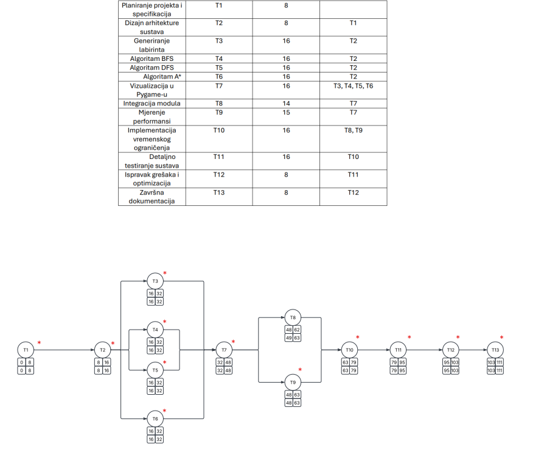
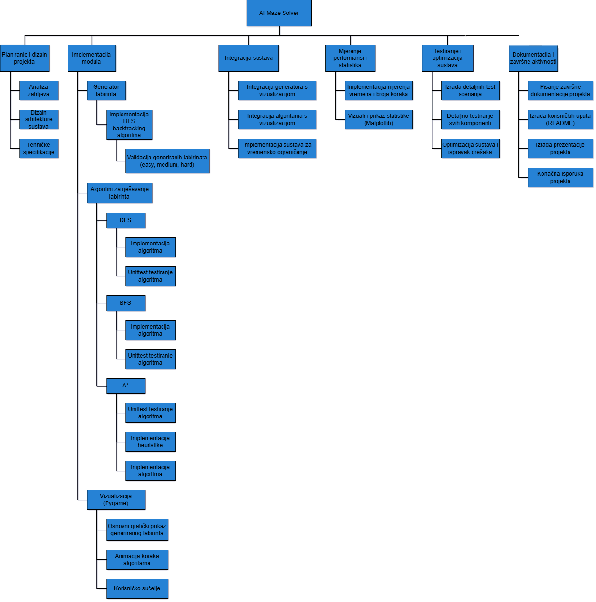
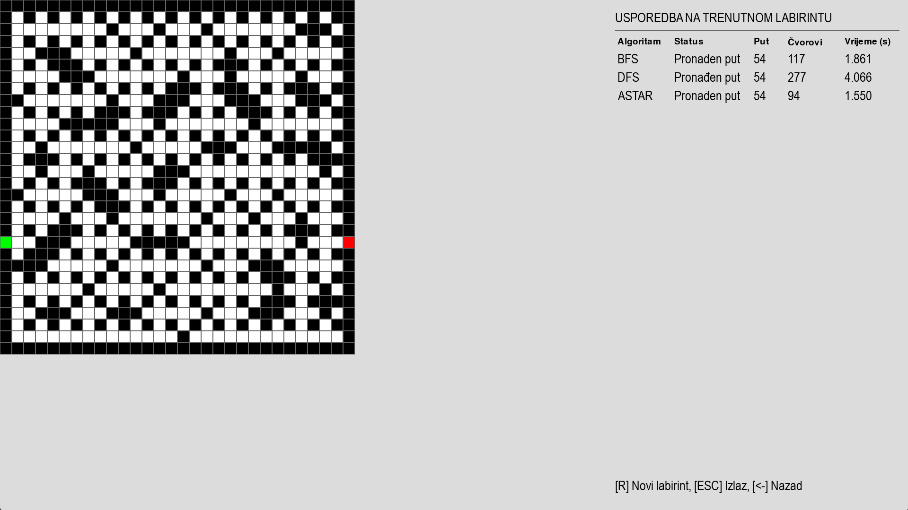

# AI Maze Solver 🚀

🎯 **AI Maze Solver** je interaktivna aplikacija koja spaja zabavu 🎮 i snagu algoritama 🧠 za rješavanje labirinta. Bilo da ste entuzijast za igre, student koji uči algoritme ili iskusni programer, ovaj projekt pruža uzbudljiv **showcase** moćnih algoritama pretraživanja puta kroz zamršene labirinte – uz vizualizacije u stvarnom vremenu i statističku usporedbu 📊! 

## 📖 Sadržaj
- [🧩 Uvod i motivacija](#-uvod-i-motivacija)
- [🚀 Ključne značajke projekta](#-ključne-značajke-projekta)
- [🛠️ Tehnologije i biblioteke](#️-tehnologije-i-biblioteke)
- [🗂️ Planiranje projekta](#️-planiranje-projekta)
- [⚙️ Instalacija](#️-instalacija)
- [🚀 Pokretanje i korištenje](#-pokretanje-i-korištenje)
- [📊 Vizualizacija i statistika](#-vizualizacija-i-statistika)
- [📁 Struktura projekta](#-struktura-projekta)
- [👥 Tim i doprinosi](#-tim-i-doprinosi)
- [🎉 Zahvala i poziv na korištenje](#-zahvala-i-poziv-na-korištenje)

## 🧩 Uvod i motivacija  
Zamislite da generirate vlastiti labirint i gledate kako računalo pronalazi izlaz dok vi pratite svaki korak! **AI Maze Solver** nastao je iz želje da se demonstrira kako različiti algoritmi pretraživanja pronalaze put kroz kompleksne zagonetke. Kroz intuitivno korisničko sučelje i atraktivne vizualizacije, ovaj projekt istovremeno educira i zabavlja, pružajući uvid u **BFS**, **DFS** i **A*** algoritme na djelu. Prepustite se istraživanju algoritamskih rješenja dok aplikacija statistički prati njihov učinak i efikasnost. 🔍🎉

## 🚀 Ključne značajke projekta  
- **Generiranje labirinta**: Jednim klikom generirajte nasumični labirint različitih dimenzija i složenosti. Svaki je labirint unikatna zagonetka spremna za rješavanje.
- **Algoritmi rješavanja**: Podržano je rješavanje labirinta trima algoritmima pretraživanja:
  - **BFS (pretraživanje u širinu)** – pronalazi najkraći put sloj po sloj.
  - **DFS (pretraživanje u dubinu)** – istražuje put do krajnjih granica prije povratka.
  - **A*** (A-star algoritam) – heuristički pretražuje najbrži put kombinirajući udaljenost i procjenu preostalog puta.
- **Interaktivni UI**: Intuitivno **grafičko sučelje** omogućuje odabir algoritma, pokretanje generiranja i rješavanja labirinta te praćenje postupka u stvarnom vremenu. 🕹️ 
- **Vizualizacija korak-po-korak**: Gledajte animaciju pretrage – algoritam boji put kojim prolazi, istražuje susjede i pronalazi rješenje. Završni pronađeni put jasno je istaknut kroz labirint. ✨
- **Statistika izvedbe**: Nakon rješavanja, aplikacija prikazuje ključne statistike: dužinu pronađenog puta, broj posjećenih polja, te vrijeme izvršavanja algoritma. Usporedite učinkovitost različitih algoritama na istom labirintu uz pomoć grafičkih prikaza i brojčanih pokazatelja. 📊
- **Edukativno i zabavno**: AI Maze Solver je odličan alat za učenje – eksperimentirajući s algoritmima korisnici mogu intuitivno razumjeti njihove razlike. Istovremeno, generiranje labirinata i promatranje rješavanja pruža puno zabave svim korisnicima.

## 🛠️ Tehnologije i biblioteke  
Projekt je izgrađen koristeći moderni **Python** ekosustav te provjerene biblioteke za razvoj vizualno privlačnih algoritamskih simulacija:  
- **Python 3.x** – Glavni programski jezik projekta, koristi se za implementaciju logike generiranja labirinta i algoritama pretraživanja.  
- **Pygame** – Biblioteka za razvoj igara i grafičkih aplikacija u Pythonu. Koristi se za izradu interaktivnog 2D sučelja, crtanje labirinta i animaciju koraka algoritama u stvarnom vremenu. 🎮  
- **Matplotlib** – Biblioteka za grafički prikaz podataka. Koristi se za kreiranje grafikona i prikaz statističkih usporedbi (npr. usporedba vremena izvršavanja algoritama). 📊  
- *(Ostale biblioteke)* – Standardne Python biblioteke poput `random` za generiranje nasumičnih labirinata, kao i `time` za mjerenje vremena, te dodatne pomoćne biblioteke navedene u **requirements.txt** datoteci.

## 🗂️ Planiranje projekta

### 📊 PERT dijagram

<br>*Slika 1.* PERT dijagram prikazuje vremenski slijed aktivnosti i kritični put projekta.

### 🏗️ Work Breakdown Structure (WBS)

<br>*Slika 2.* WBS prikazuje hijerarhijski raspored svih zadataka projekta.

## ⚙️ Instalacija  
Slijedite ove korake za postavljanje projekta na vaše računalo:  

1. **Klonirajte repozitorij**: Preuzmite izvorni kod ovog repozitorija s GitHub-a (`git clone https://github.com/Krapic/AI-Maze-Solver.git`) ili preuzmite ZIP arhivu.  
2. **Kreirajte virtualno okruženje** (preporučeno):  
   ```bash
   python3 -m venv venv             # kreiranje virtualnog okruženja
   source venv/bin/activate         # aktivacija na Linux/macOS
   venv\Scripts\activate            # aktivacija na Windows
   ```  
   Ovo osigurava izolirano okruženje za potrebne pakete, bez utjecaja na globalne instalacije.  
3. **Instalirajte ovisnosti**: U korijenu projekta pokrenite naredbu:  
   ```bash
   pip install -r requirements.txt
   ```  
   Ova naredba povući će i instalirati sve potrebne Python pakete za pokretanje aplikacije. (Provjerite da koristite `pip` unutar aktiviranog virtualnog okruženja.)  
4. **Spremni za pokretanje**: Nakon uspješne instalacije ovisnosti, projekt je spreman za korištenje! 🎉  

> **Napomena:** Potrebno je barem imati instaliran **Python 3.7+**, a naša preporuka je Python 3.10 radi potpune kompatibilnosti sa svim korištenim paketima.

## 🚀 Pokretanje i korištenje

- U terminalu se pozicionirajte u korijenski direktorij projekta i pokrenite glavnu skriptu:  
  ```bash
  python src/main.py
  ```  
- Nakon pokretanja, otvorit će se grafičko korisničko sučelje aplikacije. U sučelju možete:  
  - **Generirati labirint** – Odaberite željene postavke (težinu labirinta), zatim kliknite na gumb *"Generiraj labirint"*. Aplikacija će stvoriti novi nasumični labirint.  
  - **Odabrati algoritam** – Odaberite jedan od algoritama pretraživanja: *BFS*, *DFS* ili *A**.  
  - **Pokrenuti rješavanje** – Kliknite tipku za početak rješavanja kako biste pokrenuli odabrani algoritam. Sada možete pratiti animaciju dok algoritam prolazi kroz labirint u potrazi za izlazom. 🔄  
- **Praćenje vizualizacije** – Tijekom izvršavanja, algoritam boja trenutno istraživane putanje i čvorove labirinta. Možete vidjeti redoslijed obilaska: npr. BFS ravnomjerno širi pretragu sloj po sloj (što izgleda poput valova kroz labirint), dok DFS ide duboko u jedan smjer pa se vraća unazad. A* inteligentno skakuće prema cilju na temelju procjene udaljenosti.  
- **Prikaz rezultata** – Kada algoritam pronađe izlaz, krajnji put od starta do cilja bit će istaknut bojom. UI će također prikazati statistike poput:
  - Duljina pronađenog puta (broj koraka kroz labirint do cilja).
  - Broj posjećenih polja (čvorova) tijekom pretrage.
  - Ukupno trajanje rješavanja (u milisekundama).  
- **Eksperimentiranje** – Slobodno promijenite algoritam ili generirajte novi labirint te pokušajte ponovno. Usporedite kako različiti algoritmi pristupaju rješavanju iste zagonetke. Svako novo pokretanje donosi drugačiji izazov i priliku za učenje! 🧪

## 📊 Vizualizacija i statistika  
U nastavku su prikazani primjeri vizualizacije rada aplikacije i statističkih rezultata algoritama:  

> Animirani GIF koji prikazuje postupak rješavanja labirinta
> 

> Slika koja prikazuje statističku usporedbu algoritama (prijeđeni put, broj posjećenih čvorova i vrijeme)
> 

*_GIF gore:_ **Animacija** prikazuje korak-po-korak rješavanje generiranog labirinta pomoću jednog od algoritama. **Slika** ilustrira usporedbu performansi algoritama BFS, DFS i A* na nasumičnom labirintu.

## 📁 Struktura projekta  
Projekt je organiziran kako bi kod bio razumljiv i proširiv. Glavni dijelovi strukture (foldera i datoteka) su:  

```plaintext
AI-Maze-Solver/
├── docs/                        # Dokumentacija i mediji (slike, GIF-ovi za prezentaciju)
│   ├── WBS.png                  # Hijerarhijska podjela svih projektnih zadataka
│   ├── PERT-tehnika.png        # Pert dijagram s vremenskim prikazom zadataka
│   └── README.md                 
├── requirements.txt             # Popis potrebnih Python paketa (ovisnosti)
├── README.md                    # Ovaj README dokument projekta
├── src/                         # Izvorni kod aplikacije 
│   ├── main.py                  # Glavna skripta za pokretanje aplikacije, funkcije za mjerenje vremena, broja posjećenih čvorova, duljine pronađenog puta
│   ├── maze_generator/          # Kod za generiranje nasumičnih labirinata 
│   │   ├── __init__.py
│   │   ├── generator.py
│   ├── algorithms/              # Implementacije algoritama (BFS, DFS, A*)
│   │   ├── __init__.py
│   │   ├── bfs.py               # Implementacija BFS (Breadth-First Search)
│   │   ├── dfs.py               # Implementacija DFS (Depth-First Search)
│   │   ├── astar.py             # A* algoritam s heuristikama
│   ├── visualization/           # Kod za korisničko sučelje i vizualizaciju labirinta
│   │   ├── __init__.py
│   │   ├── pygame_ui.py         # Glavni modul za korisničko sučelje (UI) u Pygame-u
└── tests/                       # Sve testne skripte za validaciju projekta
    ├── test_generator.py
    ├── test_bfs_dfs.py
    ├── test_astar.py
    ├── test_visualization.py
    └── test_integration.py            
```

## 👥 Tim i doprinosi
Projekt AI Maze Solver rezultat je timskog rada i entuzijazma šestero studenata računarstva koji su udružili svoja znanja i vještine kako bi kreirali naprednu, vizualno privlačnu i edukativnu aplikaciju temeljenu na algoritmima umjetne inteligencije.

### 🔧 Članovi tima i njihove odgovornosti:
#### Frane Krapić
- Tehnički voditelj projekta i autor glavne aplikacijske logike koja povezuje sve komponente, od generiranja labirinta, pokretanja algoritama i upravljanja stanjima aplikacije, do integracije vizualizacije i prikaza statistike.
Razvio je kompletno interaktivno korisničko sučelje u Pygame-u, uključujući sustav izbornika, vizualizaciju stanja algoritma u stvarnom vremenu, te bočni panel sa živim i završnim statistikama (vrijeme izvršavanja, broj posjećenih čvorova, duljina puta).
Osigurao je robusnu strojnu logiku za upravljanje stanjima (FSM), obradu korisničkog unosa, rukovanje prekidima, kao i elegantno prebacivanje između težina labirinta i algoritama.
Posebno je pažnju posvetio vizualnom aspektu korisničkog iskustva, omogućujući animirano praćenje rada algoritama uz jasan prikaz svakog koraka – čime aplikacija postaje jednako edukativna i zabavna.
- Tehnologije: Python, Pygame, OOP, vizualizacija algoritama, upravljanje stanjima, performanse i UX dizajn

#### Leonardo Ilinović
- Autor sustava za generiranje nasumičnih labirinata, s prilagodljivom razinom težine (easy, medium, hard). Implementirao je naprednu varijantu Primovog algoritma za stvaranje povezane mreže prolaza unutar labirinta, uz posebnu pozornost na odabir početne i izlazne točke, osiguravajući pritom rješivost i raznolikost svake instance.
Dodatno je implementirao mehanizam za otkrivanje i automatsko rješavanje rubnih slučajeva – kada standardni izlaz ne postoji, izlaz se dinamički pozicionira na dostupnom rubu ili, u krajnjem slučaju, redefinira.
- Tehnologije: Python, Primov algoritam, algoritamski dizajn, obrada rubnih slučajeva, modularna arhitektura

#### Josip Bulić
- Zaslužan za razvoj sustava jediničnih testova (unittest) koji provjerava ispravnost generiranih labirinata kroz više razina:
  - Dimenzije i format labirinta
  - Postojanje prohodnog puta od početka do kraja
  - Povezanost svih prohodnih ćelija
  - Valjanost vrijednosti u matrici (samo 0 i 1)
- Implementirao je i algoritam za provjeru povezanosti putem BFS-a, osiguravajući da su svi dijelovi labirinta dostupni iz početne točke –> ključna pretpostavka za ispravnost algoritama pretraživanja.
- Osim testova, Josip je postavio automatsku CI integraciju koristeći GitHub Actions, konfiguriravši workflow koji uključuje:
  - Automatsku instalaciju ovisnosti
  - Analizu koda pomoću flake8
  - Pokretanje testova pomoću pytest
- Time je osigurao da svaki novi commit/pull request prođe kroz automatiziranu validaciju koda i funkcionalnosti, čime se povećava pouzdanost i profesionalnost razvoja.
- Tehnologije: Python, unittest, pytest, flake8, BFS validacija, GitHub Actions, CI/CD

#### Nika Nasteski
- Odgovorna za implementaciju BFS algoritma, koji je razvijen kao Python generator, omogućujući korak-po-korak izvođenje algoritma u stvarnom vremenu. Time je omogućena potpuna integracija s vizualizacijom u GUI-u, pri čemu svaki posjećeni čvor i trenutna putanja mogu biti prikazani tijekom pretrage.
Osim same logike pretrage, ugradila je i mehanizam za prekid algoritma nakon definiranog vremenskog limita, kao i sigurnu rekonstrukciju putanje korištenjem parent_map, što omogućuje lako praćenje i prikaz rješenja.
Kod je modularno strukturiran i spreman za testiranje, što je dodatno naglašeno kroz pisanje jediničnih testova za različite konfiguracije labirinta, uključujući slučajeve s nedostupnim ciljem.
- Tehnologije: Python, algoritmi grafova, generatori, vizualizacija stanja, testiranje vremenskih ograničenja

#### Viktor Švast
- Razvio je naprednu i visoko optimiziranu implementaciju A* algoritma za pretragu puta, koristeći Manhattan heuristiku i prioritetnu listu (min-heap) za efikasno upravljanje čvorovima otvorene liste.
Njegova implementacija podržava vizualizaciju pretrage u stvarnom vremenu, uz kontinuirano izvještavanje o trenutačnom čvoru, već posjećenim čvorovima i trenutnoj putanji, što omogućuje potpunu integraciju u animirani prikaz algoritma.
U kod je ugrađen detaljan statistički nadzor: broj posjećenih čvorova i ukupno trajanje izvođenja prate se u svakom trenutku, a podržano je i vremensko ograničenje za rješavanje, s preciznim rukovanjem time-out situacijama i bespovratnim pretragama.
Njegov rad ističe se i po modularnosti i čitljivosti koda, što omogućuje lako proširenje na dodatne heuristike (npr. euklidska udaljenost) i upotrebu u složenijim topologijama.
- Tehnologije: Python, A algoritam, heurističko pretraživanje, heapq, performanse i statistika algoritama

#### Damjan Antunović
- Zadužen za implementaciju DFS algoritma kao generativnog procesa koji omogućuje korak-po-korak izvođenje i interaktivnu vizualizaciju napretka kroz labirint. Njegova verzija DFS-a koristi eksplicitni stog, vlastitu parent mapu za kasniju rekonstrukciju puta i dinamičku kontrolu vremenskog ograničenja, čime se osigurava stabilno ponašanje i pri složenijim labirintima.
Implementacija podržava detaljno praćenje obilaska čvorova i nudi konzistentnu integraciju s grafičkim prikazom stanja algoritma. Posebna pozornost posvećena je učinkovitom rukovanju dubokim rekurzijskim putevima i slučajevima kada rješenje ne postoji.
Njegov kod odlikuje se jasnoćom i modularnošću, što omogućuje jednostavno testiranje, proširenje i ponovnu upotrebu u drugim AI sustavima temeljenim na grafovima.
- Tehnologije: Python, DFS algoritam, algoritmi grafova, vremensko upravljanje, generativni pristup

🔬 Kroz timsku suradnju, code review sesije i iterativni razvoj, projekt je razvijen u duhu najboljih praksi softverskog inženjerstva. Svaki član tima doprinio je specifičnim znanjem iz područja umjetne inteligencije, algoritama, vizualizacije, testiranja i automatizacije razvoja.

## 🎉 Zahvala i poziv na korištenje  
Hvala vam što ste odvojili vrijeme za pregled ovog projekta! 🙏 Nadamo se da će vam ovaj alat biti jednako zabavan i koristan kao što je bio i nama tijekom razvoja. Pozivamo vas da isprobate aplikaciju, podijelite je s drugima i javite nam svoje dojmove.  

Ako vam se projekt sviđa, ne zaboravite ostaviti ⭐ zvjezdicu i doprinijeti širenju riječi. Sretno rješavanje labirinata i uživajte u istraživanju algoritama! 🎯🤖

Slobodno nam se obratite putem **GitHub Issues** stranice ili emaila za bilo kakva pitanja, prijedloge ili suradnju. Cijenimo povratne informacije i rado ćemo pomoći oko korištenja projekta ili razvoja novih značajki!
