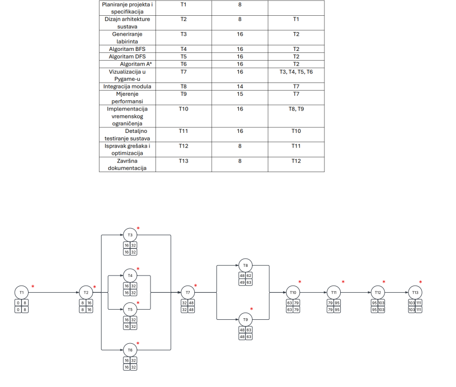
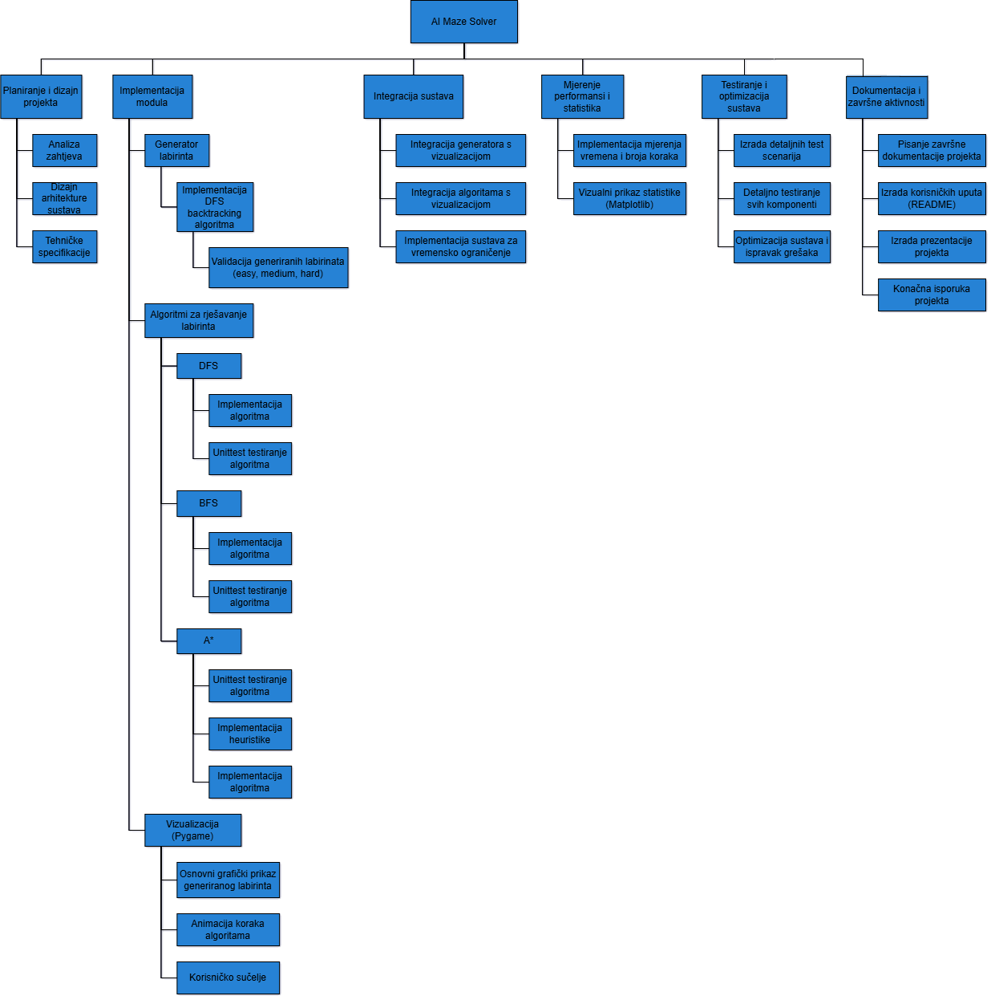
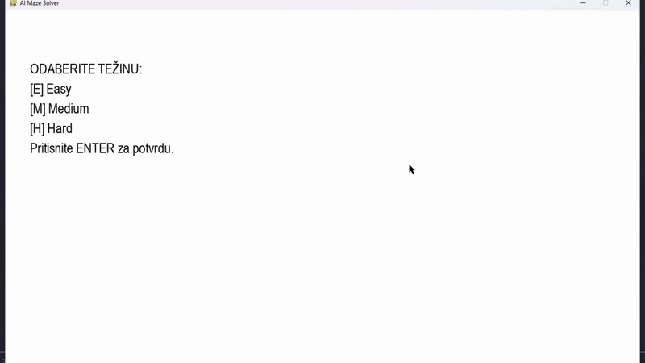
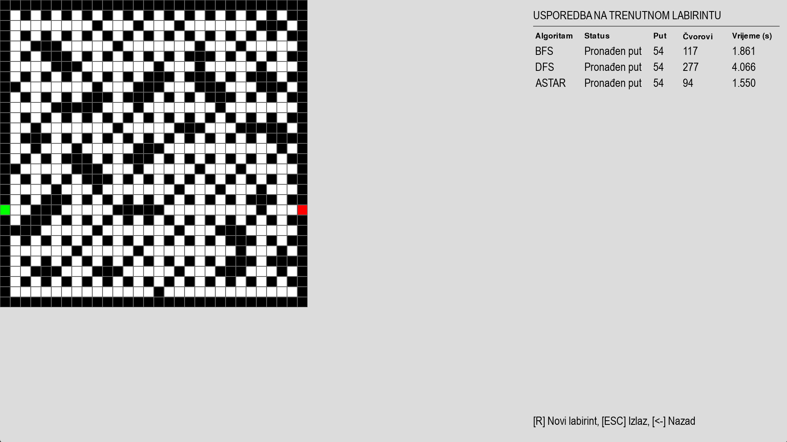

# AI Maze Solver 🚀

🎯 **AI Maze Solver** is an interactive application that combines fun 🎮 and the power of algorithms 🧠 to solve mazes. Whether you are a gaming enthusiast, a student learning algorithms, or an experienced developer, this project offers an exciting **showcase** of powerful pathfinding algorithms navigating through intricate mazes – with real-time visualizations and statistical comparisons 📊!

## 📖 Table of Contents
- [🧩 Introduction and Motivation](#-introduction-and-motivation)
- [🚀 Key Features](#-key-features)
- [🛠️ Technologies and Libraries](#️-technologies-and-libraries)
- [🗂️ Project Planning](#️-project-planning)
- [⚙️ Installation](#️-installation)
- [🚀 Running and Usage](#-running-and-usage)
- [📊 Visualization and Statistics](#-visualization-and-statistics)
- [📁 Project Structure](#-project-structure)
- [👥 Team and Contributions](#-team-and-contributions)
- [🎉 Acknowledgements and Invitation](#-acknowledgements-and-invitation)

## 🧩 Introduction and Motivation
Imagine generating your own maze and watching the computer find the exit while you follow every step! **AI Maze Solver** was born from the desire to demonstrate how different search algorithms find paths through complex puzzles. Through an intuitive user interface and attractive visualizations, this project both educates and entertains, providing insight into **BFS**, **DFS**, and **A\*** algorithms in action. Dive into exploring algorithmic solutions while the application statistically tracks their performance and efficiency. 🔍🎉

## 🚀 Key Features
- **Maze Generation**: Generate a random maze of various dimensions and complexity with a single click. Each maze is a unique puzzle ready to be solved.
- **Solving Algorithms**: Maze solving is supported using three search algorithms:
  - **BFS (Breadth-First Search)** – finds the shortest path layer by layer.
  - **DFS (Depth-First Search)** – explores paths to their furthest limits before backtracking.
  - **A\*** (A-star algorithm) – heuristically searches for the fastest path by combining distance and an estimate of the remaining path.
- **Interactive UI**: An intuitive **graphical interface** allows you to select an algorithm, trigger maze generation and solving, and follow the process in real time. 🕹️
- **Step-by-Step Visualization**: Watch the search animation – the algorithm colors the path it traverses, explores neighbors, and finds the solution. The final discovered path is clearly highlighted through the maze. ✨
- **Performance Statistics**: After solving, the application displays key statistics: the length of the found path, the number of visited cells, and the algorithm's execution time. Compare the efficiency of different algorithms on the same maze using graphical displays and numerical indicators. 📊
- **Educational and Fun**: AI Maze Solver is an excellent learning tool – by experimenting with algorithms, users can intuitively understand their differences. At the same time, generating mazes and watching them being solved provides plenty of fun for all users.

## 🛠️ Technologies and Libraries
The project is built using the modern **Python** ecosystem and proven libraries for developing visually appealing algorithmic simulations:
- **Python 3.x** – The main programming language of the project, used to implement maze generation logic and search algorithms.
- **Pygame** – A library for developing games and graphical applications in Python. Used to create the interactive 2D interface, draw the maze, and animate algorithm steps in real time. 🎮
- **Matplotlib** – A library for graphical data display. Used to create charts and display statistical comparisons (e.g., comparing algorithm execution times). 📊
- *(Other libraries)* – Standard Python libraries such as `random` for generating random mazes, `time` for time measurement, and additional utility libraries listed in the **requirements.txt** file.

## 🗂️ Project Planning

### 📊 PERT Diagram

<br>*Figure 1.* The PERT diagram shows the chronological sequence of activities and the critical path of the project.

### 🏗️ Work Breakdown Structure (WBS)

<br>*Figure 2.* The WBS shows the hierarchical arrangement of all project tasks.

## ⚙️ Installation
Follow these steps to set up the project on your machine:

1. **Clone the repository**: Download the source code of this repository from GitHub (`git clone https://github.com/Krapic/AI-Maze-Solver.git`) or download the ZIP archive.
2. **Create a virtual environment** (recommended):
   ```bash
   python3 -m venv venv             # create virtual environment
   source venv/bin/activate         # activate on Linux/macOS
   venv\Scripts\activate            # activate on Windows
   ```
   This ensures an isolated environment for the required packages without affecting global installations.
3. **Install dependencies**: From the project root, run:
   ```bash
   pip install -r requirements.txt
   ```
   This command will fetch and install all the required Python packages to run the application. (Make sure to use `pip` inside the activated virtual environment.)
4. **Ready to run**: After successfully installing the dependencies, the project is ready to use! 🎉

> **Note:** You need at least **Python 3.7+** installed; we recommend Python 3.10 for full compatibility with all used packages.

## 🚀 Running and Usage

- In your terminal, navigate to the project root directory and run the main script:
  ```bash
  python src/main.py
  ```
- After launching, the graphical user interface of the application will open. In the interface you can:
  - **Generate a maze** – Select the desired settings (maze difficulty), then click the *"Generate Maze"* button. The application will create a new random maze.
  - **Select an algorithm** – Choose one of the search algorithms: *BFS*, *DFS*, or *A\**.
  - **Start solving** – Click the solve button to launch the selected algorithm. You can now follow the animation as the algorithm navigates through the maze in search of the exit. 🔄
- **Following the visualization** – During execution, the algorithm colors the currently explored paths and maze nodes. You can see the traversal order: e.g., BFS evenly spreads the search layer by layer (which looks like waves through the maze), while DFS goes deep in one direction and then backtracks. A* intelligently jumps toward the goal based on a distance estimate.
- **Displaying results** – When the algorithm finds the exit, the final path from start to goal will be highlighted in color. The UI will also display statistics such as:
  - Length of the found path (number of steps through the maze to the goal).
  - Number of visited cells (nodes) during the search.
  - Total solving duration (in milliseconds).
- **Experimenting** – Feel free to change the algorithm or generate a new maze and try again. Compare how different algorithms approach solving the same puzzle. Each new run brings a different challenge and a learning opportunity! 🧪

## 📊 Visualization and Statistics
Below are examples of the application's visualization and the statistical results of the algorithms:

> Animated GIF showing the maze-solving process
> 

> Image showing the statistical comparison of algorithms (path taken, number of visited nodes, and time)
> 

*_GIF above:_ The **animation** shows the step-by-step solving of a generated maze using one of the algorithms. The **image** illustrates the performance comparison of the BFS, DFS, and A* algorithms on a random maze.*

## 📁 Project Structure
The project is organized to keep the code understandable and extensible. The main parts of the structure (folders and files) are:

```plaintext
AI-Maze-Solver/
├── docs/                        # Documentation and media (images, GIFs for presentation)
│   ├── WBS.png                  # Hierarchical breakdown of all project tasks
│   ├── PERT-tehnika.png         # PERT diagram with a time-based view of tasks
│   └── README.md
├── requirements.txt             # List of required Python packages (dependencies)
├── README.md                    # This project README document
├── src/                         # Application source code
│   ├── main.py                  # Main script for launching the app; functions for measuring time, number of visited nodes, and path length
│   ├── maze_generator/          # Code for generating random mazes
│   │   ├── __init__.py
│   │   ├── generator.py
│   ├── algorithms/              # Algorithm implementations (BFS, DFS, A*)
│   │   ├── __init__.py
│   │   ├── bfs.py               # BFS (Breadth-First Search) implementation
│   │   ├── dfs.py               # DFS (Depth-First Search) implementation
│   │   ├── astar.py             # A* algorithm with heuristics
│   ├── visualization/           # Code for the user interface and maze visualization
│   │   ├── __init__.py
│   │   ├── pygame_ui.py         # Main module for the Pygame user interface (UI)
└── tests/                       # All test scripts for project validation
    ├── test_generator.py
    ├── test_bfs_dfs.py
    ├── test_astar.py
    ├── test_visualization.py
    └── test_integration.py
```

## 👥 Team and Contributions
The AI Maze Solver project is the result of the teamwork and enthusiasm of six computer science students who combined their knowledge and skills to create an advanced, visually appealing, and educational application based on artificial intelligence algorithms.

### 🔧 Team Members and Their Responsibilities:
#### Frane Krapić
- Technical project lead and author of the main application logic that connects all components – from maze generation, algorithm execution, and application state management, to visualization integration and statistics display.
Developed the complete interactive user interface in Pygame, including a menu system, real-time algorithm state visualization, and a side panel with live and final statistics (execution time, number of visited nodes, path length).
Ensured robust finite state machine (FSM) logic for state management, user input handling, interrupt handling, and smooth switching between maze difficulties and algorithms.
Special attention was given to the visual aspect of the user experience, enabling animated tracking of algorithm execution with a clear display of every step – making the application equally educational and enjoyable.
- Technologies: Python, Pygame, OOP, algorithm visualization, state management, performance and UX design

#### Leonardo Ilinović
- Author of the random maze generation system, with an adjustable difficulty level (easy, medium, hard). Implemented an advanced variant of Prim's algorithm for creating a connected network of passages within the maze, with special attention to selecting the start and exit points, ensuring solvability and variety for each instance.
Additionally implemented a mechanism for detecting and automatically resolving edge cases – when the standard exit does not exist, the exit is dynamically positioned on an available border or, as a last resort, redefined.
- Technologies: Python, Prim's algorithm, algorithmic design, edge case handling, modular architecture

#### Josip Bulić
- Responsible for developing a unit test system (unittest) that verifies the correctness of generated mazes at multiple levels:
  - Maze dimensions and format
  - Existence of a passable path from start to finish
  - Connectivity of all passable cells
  - Validity of values in the matrix (only 0 and 1)
- Also implemented a BFS-based connectivity verification algorithm, ensuring that all parts of the maze are reachable from the starting point – a key prerequisite for the correctness of search algorithms.
- In addition to tests, Josip set up automated CI integration using GitHub Actions, configuring a workflow that includes:
  - Automatic dependency installation
  - Code analysis using flake8
  - Running tests using pytest
- This ensures that every new commit/pull request passes through automated code and functionality validation, increasing the reliability and professionalism of development.
- Technologies: Python, unittest, pytest, flake8, BFS validation, GitHub Actions, CI/CD

#### Nika Nasteski
- Responsible for implementing the BFS algorithm, developed as a Python generator enabling step-by-step real-time execution. This allows full integration with the GUI visualization, where every visited node and current path can be displayed during the search.
Beyond the search logic itself, she embedded a mechanism for interrupting the algorithm after a defined time limit, as well as safe path reconstruction using a parent_map, enabling easy tracking and display of the solution.
The code is modularly structured and ready for testing, further highlighted by writing unit tests for various maze configurations, including cases with an unreachable goal.
- Technologies: Python, graph algorithms, generators, state visualization, time-limit testing

#### Viktor Švast
- Developed an advanced and highly optimized A* pathfinding implementation using the Manhattan heuristic and a priority queue (min-heap) for efficient management of open-list nodes.
His implementation supports real-time search visualization, with continuous reporting of the current node, already-visited nodes, and the current path, enabling full integration into the animated algorithm display.
Detailed statistical monitoring is built into the code: the number of visited nodes and total execution duration are tracked at all times, and solving time limits are supported, with precise handling of time-out situations and dead-end searches.
His work also stands out for code modularity and readability, allowing easy extension to additional heuristics (e.g., Euclidean distance) and use in more complex topologies.
- Technologies: Python, A* algorithm, heuristic search, heapq, algorithm performance and statistics

#### Damjan Antunović
- In charge of implementing the DFS algorithm as a generative process that enables step-by-step execution and interactive visualization of progress through the maze. His DFS version uses an explicit stack, a custom parent map for later path reconstruction, and dynamic time-limit control, ensuring stable behavior even with more complex mazes.
The implementation supports detailed node-visit tracking and offers consistent integration with the graphical algorithm state display. Special attention was paid to efficiently handling deep recursive paths and cases where no solution exists.
His code is characterized by clarity and modularity, enabling easy testing, extension, and reuse in other graph-based AI systems.
- Technologies: Python, DFS algorithm, graph algorithms, time management, generative approach

🔬 Through teamwork, code review sessions, and iterative development, the project was built in the spirit of software engineering best practices. Each team member contributed specific expertise in the areas of artificial intelligence, algorithms, visualization, testing, and development automation.

## 🎉 Acknowledgements and Invitation
Thank you for taking the time to review this project! 🙏 We hope this tool will be as fun and useful for you as it was for us during development. We invite you to try the application, share it with others, and let us know your thoughts.

If you enjoy the project, don't forget to leave a ⭐ star and help spread the word. Happy maze solving and enjoy exploring the algorithms! 🎯🤖

Feel free to reach out via the **GitHub Issues** page or by email for any questions, suggestions, or collaboration. We appreciate feedback and will be happy to help with using the project or developing new features!
